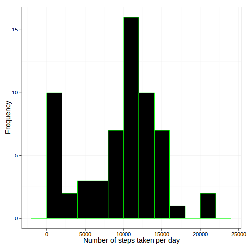
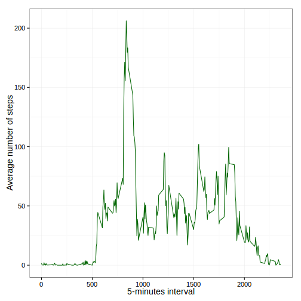
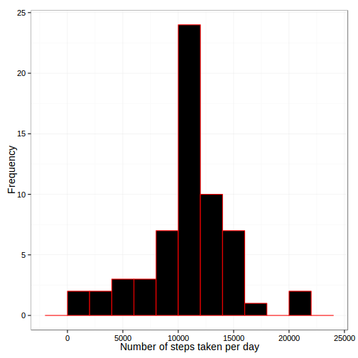
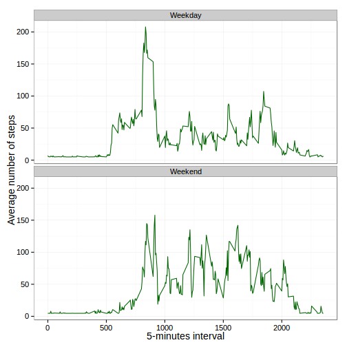

# Reproducible Research Course - Peer Assessment One #

### Rodrigo Sant'Ana ###

#### November, 2015 ####

* * *

## Overview ##

In this first peer assignment of the Reproducible Research course of
[Coursera](http://www.coursera.org), it was investigated data about
personal activity monitoring devices. Know a days, it is possible to
collect a large amount of data about personal movement using activity
monitoring devices such as a Fitbit, Nike Fuelband, or Jawbone Up. These
type of devices are part of the “quantified self” movement – a group of
enthusiasts who take measurements about themselves regularly to improve
their health, to find patterns in their behavior, or because they are
tech geeks. But these data remain under-utilized both because the raw
data are hard to obtain and there is a lack of statistical methods and
software for processing and interpreting the data.

This assignment makes use of data from a personal activity monitoring
device. This device collects data at 5 minute intervals through out the
day. The data consists of two months of data from an anonymous
individual collected during the months of October and November, 2012 and
include the number of steps taken in 5 minute intervals each day. 

**About Data**

The data for this assignment can be downloaded from the course web site:

* **_Dataset_**:
[Activity monitoring data](https://d396qusza40orc.cloudfront.net/repdata%2Fdata%2Factivity.zip)
[52K]

The variables included in this dataset are:

* _steps_: Number of steps taking in a 5-minute interval (missing values
  are coded as NA);

* _date_: The date on which the measurement was taken in YYYY-MM-DD
  format;

* _interval_: Identifier for the 5-minute interval in which measurement
  was taken;

The dataset is stored in a comma-separated-value (CSV) file and there
are a total of 17,568 observations in this dataset.

## Loading and preprocessing the data

The following commands was used to load the database into
[**_R_**](http://www.r-project.org). The function choosen to did that
was **read.table()**.


```r
### Loading data into R...
df <- read.table("activity.csv", header = TRUE, sep = ",", dec = ".",
                 colClasses = c("numeric", "character", "numeric"))

### Observing the structure of the dataset loaded in R...
str(df)
```

```
'data.frame':	17568 obs. of  3 variables:
 $ steps   : num  NA NA NA NA NA NA NA NA NA NA ...
 $ date    : chr  "2012-10-01" "2012-10-01" "2012-10-01" "2012-10-01" ...
 $ interval: num  0 5 10 15 20 25 30 35 40 45 ...
```

The next step was aimed in to preprocessing and transforming data into
format suitable for analysis. In this way, the variable called "date"
was transformed from character to date format using the function *ymd()*
available in lubridate **_R_** package.


```r
### Loading lubridate R package...
library(lubridate)

### Converting date variable...
df$date <- ymd(df$date)
```

## What is mean total number of steps taken per day?

For this part of the peer assignment it was ignored the missign values
in dataset and was evaluated the total number of steps taken each day
and after that it was calculated the central tendency of the total
number of steps taken per day in terms of average and median. A
histogram of the total number of steps taken per day was plotted to
evaluate the shape and behaviour of this new variable.

In this part of the assignment, it was used some new **_R_** packages
like was _ggplot2_ and _dplyr_.


```r
### Loading ggplot2 and dplyr R packages...
library(dplyr)
library(ggplot2)

### Calculating the total number of steps per day...
steps.day <- df %>% group_by(date) %>%
    summarise(total = sum(steps, na.rm = TRUE))

### Evaluating the average and median of the total number of steps per
### day...
av.steps <- mean(steps.day$total, na.rm = TRUE)
av.steps
```

```
[1] 9354.23
```

```r
median.steps <- median(steps.day$total, na.rm = TRUE)
median.steps
```

```
[1] 10395
```

```r
### Histogram of the total number of steps per day...
ggplot(steps.day, aes(x = total)) +
    geom_histogram(fill = "black", colour = "green", binwidth = 2000) +
    labs(x = "Number of steps taken per day",
         y = "Frequency") +
    theme_bw(base_size = 14, base_family = "Arial")
```

 

The central tendencies in terms of average and median computed to the
number of steps taken per day was **9354** and
**10395**, respectively.

## What is the average daily activity pattern?

Here, it was considered the average of daily activity pattern. For that,
it was evaluated the average number of steps taken by interval of time
in each day.


```r
### Estimating the average of steps per interval of time...
act.interval <- df %>% group_by(interval) %>%
    summarise(average = mean(steps, na.rm = TRUE))

### Plotting the time series of 5-minutes interval and average number of
### steps taken in all days...
ggplot(act.interval, aes(x = interval, y = average)) +
    geom_line(color = "darkgreen") +
    labs(x = "5-minutes interval", y = "Average number of steps") +
    theme_bw(base_size = 14, base_family = "Arial")
```

 

The 5 minute interval, on average across all the days in dataset, that
contains the maximum number of steps is **835$^{th}$** interval, that
showed a maximum **206** steps. To estimate this value it was used the
following statements below.


```r
### Evaluating the maximum number of steps in 5 minute interval...
act.interval[which.max(act.interval$average),]
```

```
Source: local data frame [1 x 2]

  interval  average
     (dbl)    (dbl)
1      835 206.1698
```

## Imputing missing values

Now, it was calculated and reported the total number of missing values
in dataset.

1. Calculate and report the total number of missing values in the
   dataset (i.e. the total number of rows with NA’s)


```r
### Counting the number of missing values - NA's...
n.NA <- sum(is.na(df$steps))
```
The total number of missing values in dataset are **2304**.

2. Devise a strategy for filling in all of the missing values in the
   dataset. The strategy does not need to be sophisticated. For example,
   you could use the mean/median for that day, or the mean for that
   5-minute interval, etc.

3. Create a new dataset that is equal to the original dataset but with
   the missing data filled in.

The stratefy used here to imput values for missing data was aimed in to
replace each *NA* by the mean of the steps variable.


```r
### Identifying the missing values...
miss.pos <- which(is.na(df$steps))

### Imputing data by the mean..
df.imput <- df
df.imput[miss.pos, "steps"] <- mean(df.imput$steps, na.rm = TRUE)
```

4. Make a histogram of the total number of steps taken each day and
   Calculate and report the mean and median total number of steps taken
   per day. Do these values differ from the estimates from the first
   part of the assignment? What is the impact of imputing missing data
   on the estimates of the total daily number of steps?


```r
### Calculating the total number of steps per day...
steps.day.NA <- df.imput %>% group_by(date) %>%
    summarise(total = sum(steps, na.rm = TRUE))

### Evaluating the average and median of the total number of steps per
### day...
av.steps.NA <- mean(steps.day.NA$total)
av.steps.NA
```

```
[1] 10766.19
```

```r
median.steps.NA <- median(steps.day.NA$total)
median.steps.NA
```

```
[1] 10766.19
```

```r
### Histogram of the total number of steps per day...
ggplot(steps.day.NA, aes(x = total)) +
    geom_histogram(fill = "black", colour = "red", binwidth = 2000) +
    labs(x = "Number of steps taken per day",
         y = "Frequency") +
    theme_bw(base_size = 14, base_family = "Arial")
```

 

The average and median estimated now, with imputed values, were
**10766** and **10766**
respectively. It is possible to observe the difference between the
central tendencies estimated here, with imputing process, and the
values estimated previously in the first part of this assignment.

## Are there differences in activity patterns between weekdays and weekends?

Finally, it was analyzed the differences in patterns of average steps by
5 minute intervals on activities between weekdays and weekends. For
that, it was necessary to create two new variables in dataset, one to
store the classification of weekdays and other to store the type of
day. 


```r
### Creating new variables in dataset...
df.imput$daysofweek <- weekdays(df.imput$date)
df.imput$typeofday <- NULL
for(i in 1:nrow(df.imput)) {
    if(df.imput$daysofweek[i] %in% c("segunda", "terça", "quarta", "quinta",
                               "sexta")) {
        df.imput$typeofweek[i] <- "Weekday"
    } else {
        df.imput$typeofweek[i] <- "Weekend"
    }
}

### Estimating the average of steps per interval of time...
act.int.wd <- df.imput %>% group_by(typeofweek, interval) %>%
    summarise(average = mean(steps))

### Plotting the time series of 5-minutes interval and average number of
### steps taken in all days...
ggplot(act.int.wd, aes(x = interval, y = average)) +
    geom_line(color = "darkgreen") +
    facet_wrap(~ typeofweek, ncol = 1) +
    labs(x = "5-minutes interval", y = "Average number of steps") +
    theme_bw(base_size = 14, base_family = "Arial")
```

 
